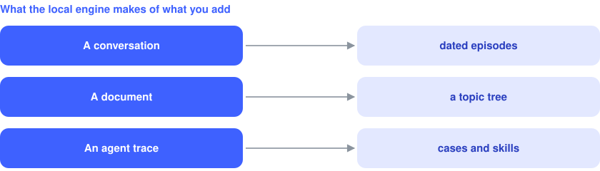

# membase-ai local engine

`pip install 'membase-ai[local]'` runs the memory on your machine. For the hosted API and the
methods, see the [Membase docs](https://docs.membase.ai/build/reference/sdk-quickstart/).

## What the local engine stores

<p align="center">
  
</p>

## Local memory over HTTP

```bash
membase --local serve            # http://127.0.0.1:8787/v1
```

The hosted API's agent-protocol routes, answered by the local engine: point any client's base URL
at it. Set `MEMBASE_LOCAL_TOKEN` to require it as a bearer token.

## Local settings

Stores: `~/.membase/memory.db` (default container), `~/.membase/containers/<id>/` (others),
`~/.membase/profile/` (static facts). Settings come from the environment, or from a `.env` file in
the current directory or a parent.

| Setting | Default | |
|---|---|---|
| `OPENAI_API_KEY` | | chat and embeddings |
| `MEMBASE_LLM_PROVIDER` | from your keys | `openai`, `anthropic`, `ollama` or `openai-compat` for chat; set the models below to match |
| `MEMBASE_LLM_ENDPOINT` | | base URL for `ollama` or `openai-compat` |
| `MEMBASE_EMBED_PROVIDER` | `openai` | `openai-compat` uses `MEMBASE_LLM_ENDPOINT` |
| `MEMBASE_EMBED_MODEL` | `text-embedding-3-small` | embeddings |
| `MEMBASE_EPISODE_MODEL` | `gpt-4.1-mini` | conversations into episodes |
| `MEMBASE_DECIDER_MODEL` | `gpt-4o-mini` | picks the episodes a search returns |
| `MEMBASE_READER_MODEL` | `gpt-4o` | `ask` answers |
| `MEMBASE_KNOWLEDGE_MODEL` | `gpt-4o-mini` | documents into topic trees |
| `MEMBASE_AGENT_MODEL` | `gpt-4o-mini` | agent traces |
| `MEMBASE_LANG` | `en` | `zh` for Chinese extraction prompts |

`MEMBASE_LOCAL=1` makes local the default when `MEMBASE_API_KEY` is not set.

## Repository

`membase/` is the Python package (`client.py`, `cli.py`, `local/` for local memory and `membase serve`,
`mcp/` for `membase mcp`); `typescript/` is the npm package. `membase-sdk` (PyPI and npm) is the
earlier name, kept as an alias.
